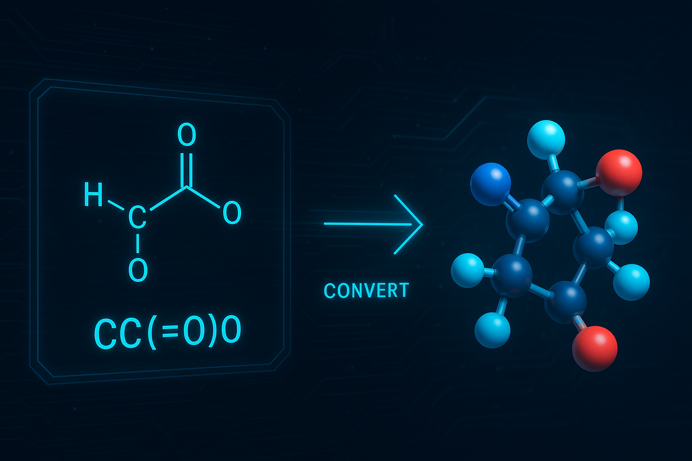

# smile2dock: SMILES-to-3D Molecular Format Converter



smile2dock converts SMILES strings (single molecules or libraries) into 3D structures and common molecular file formats (PDB, PDBQT, MOL2, SDF). It also computes several molecular descriptors with RDKit and supports protonation enumeration via Dimorphite-DL.

This repository contains two main improved entry points:

- `smile2dock_v3.py` — Improved core implementation with input validation, logging, resource management and tests.
- `smile2dock_v3_GNNimplicitsolvent.py` — Adds optional GNNImplicitSolvent-based implicit-solvent minimization on top of the v3 base.

## What is new in v3

- Validates SMILES and numeric CLI args
- Centralized constants and configuration
- Timestamped, consistent logging
- Context-managed file operations and explicit RDKit object cleanup
- MMFF geometry optimization with convergence checks
- Protonation enumeration with `dimorphite_dl` (with pH validation)
- Optional GNN-based implicit-solvent minimization support
- Unit tests in `tests/` with a small test runner

## Requirements

- Python 3.8+
- RDKit
- OpenBabel (`openbabel` / `pybel`)
- dimorphite-dl
- numpy

Optional (for GNN features):

- `GNNImplicitSolvent` (installed from GitHub)
- PyTorch, torch-geometric, OpenMM, OpenFF (required by GNNImplicitSolvent)

See `requirements.txt` for recommended versions and the GNN package reference.

## Installation

Clone and install dependencies. We recommend a conda/mamba environment for RDKit/OpenMM/OpenFF:

```bash
git clone git@github.com:elvismartis/smile2dock.git
cd smile2dock
# create a conda environment (example)
mamba create -n smile2dock python=3.10 -y
mamba activate smile2dock
# install core deps
mamba install -c conda-forge rdkit openbabel numpy -y
pip install -r requirements.txt
```

If you do not plan to use the GNN-based minimizer, you can skip installing the heavy ML/MD dependencies.

## Example usage

Standard single-molecule conversion (v3):

```bash
python3 smile2dock_v3.py -i "CCO" -o ethanol
```

Protonation enumeration:

```bash
python3 smile2dock_v3.py -i "CCO" --protonate --ph_min 7.0 --ph_max 7.4 -o ethanol_ph
```

GNN implicit-solvent minimization (requires `GNNImplicitSolvent`):

```bash
python3 smile2dock_v3_GNNimplicitsolvent.py -i "CCO" --use_gnn --solvent DMSO -o ethanol_gnn
```

Batch processing:

```bash
python3 smile2dock_v3.py -i molecules.smi -o batch_output --protonate
```

## Command-line flags (summary)

- `-i/--input` : SMILES string or path to a SMILES file (required)
- `-o/--output`: Output directory or base filename
- `-n/--num_confs`: Number of conformers to generate (default: 10)
- `--protonate` : Enable protonation enumeration
- `--ph_min/--ph_max`: pH range for protonation
- `--use_gnn` : Use GNN-based implicit-solvent optimization (GNN script only)
- `--solvent` : Solvent name for GNN implicit-solvent minimization

Run `-h/--help` on either script for full option lists.

## Output

For each molecule the tool will attempt to produce:

- `*.pdb`  — PDB format
- `*.pdbqt` — PDBQT (AutoDock Vina)
- `*.mol2` — MOL2
- `*.sdf`  — SDF

The tool also logs computed properties (MW, LogP, TPSA, H-bond donors/acceptors, rotatable bonds, ring counts, etc.).

## Tests

A basic unit-test suite lives under `tests/`. The GNN tests are skipped automatically if `GNNImplicitSolvent` is not installed.

To run tests after installing requirements:

```bash
pip install -r requirements.txt
python3 -m tests.run_tests
```

## CHANGELOG

See `CHANGELOG.md` for a full list of changes from legacy `smile2dock.py` to v3 and the GNN-enabled variant.

## Citation

If you use Dimorphite-DL, please cite:

Ropp PJ, Kaminsky JC, Yablonski S, Durrant JD (2019) Dimorphite-DL: An open-source program for enumerating the ionization states of drug-like small molecules. J Cheminform 11:14. doi: 10.1186/s13321-019-0336-9.

If you use the GNNImplicitSolvent functionality, please cite that project's authors (see their repository for citation details).

## Contact

Open an issue or email: elvis.afmartis@gmail.com

